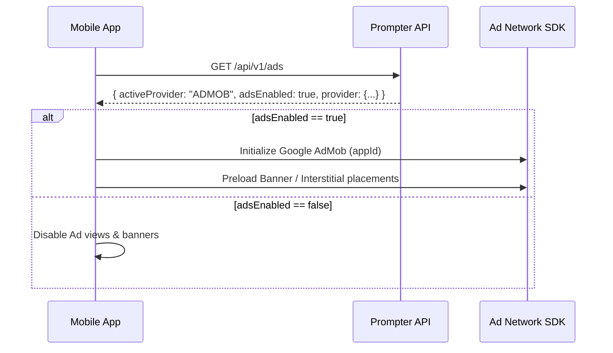

# 📱 Prompter Client Application API Documentation

> **Version:** `1.0.0`  
> **Protocol:** REST / JSON  
> **Default Base URL:** `http://localhost:3000` (Development) or `https://your-domain.com` (Production)  
> **API Version Prefix:** `/api/v1`

Welcome to the **Prompter Client API** documentation. These endpoints are designed specifically for consumer client applications (iOS, Android, Flutter, React Native, and Web clients) to consume prompt libraries, category taxonomies, monetization configs, application branding, and push notification links without administrative authentication.

---

## 📑 Table of Contents
1. [Authentication & Security](#1-authentication--security)
2. [Global Standards & Error Handling](#2-global-standards--error-handling)
3. [Deep Linking Schema](#3-deep-linking-schema)
4. [Endpoints Reference](#4-endpoints-reference)
   - [4.1 App Configuration (`GET /api/v1/app-config`)](#41-get-apiv1app-config)
   - [4.2 Legal & Social URLs (`GET /api/v1/urls`)](#42-get-apiv1urls)
   - [4.3 Ad Network Configuration (`GET /api/v1/ads`)](#43-get-apiv1ads)
   - [4.4 Category Taxonomy (`GET /api/v1/categories`)](#44-get-apiv1categories)
   - [4.5 Prompts Feed & Search (`GET /api/v1/prompts`)](#45-get-apiv1prompts)
   - [4.6 Prompt Detail (`GET /api/v1/prompts/:id`)](#46-get-apiv1promptsid)
   - [4.7 Register User Engagement (`POST /api/v1/prompts/:id/action`)](#47-post-apiv1promptsidaction)
   - [4.8 User Profile & Google Sync (`POST /api/v1/users/sync`)](#48-post-apiv1userssync)
5. [Special Implementations](#5-special-implementations)
   - [Deterministic Non-Repeating Random Sorting](#deterministic-non-repeating-random-sorting)
   - [Ad Network Runtime Initialization](#ad-network-runtime-initialization)
   - [Maintenance Mode Handling](#maintenance-mode-handling)
6. [Code Samples](#6-code-samples)
   - [cURL](#curl)
   - [TypeScript / JavaScript](#typescript--javascript)
   - [Flutter / Dart](#flutter--dart)
   - [Android (Kotlin)](#android-kotlin)
   - [iOS (Swift)](#ios-swift)

---

## 1. Authentication & Security

Client API endpoints are secured via a static **Client API Key** passed in the HTTP request headers.

### Required Header
```http
x-api-key: YOUR_CLIENT_API_KEY
```

> **Default Development Key:** `prompter_live_sec_7f8a9b1c2d3e4f5a`  
> *(Super Admins can view, regenerate, or toggle API Key enforcement on or off inside the Admin Panel under **Client API Endpoints** or **Settings**).*

If API key enforcement is disabled by the administrator in the Admin Panel, requests will succeed even without the header. When enabled, requests without a valid key receive HTTP `401 Unauthorized`.

---

## 2. Global Standards & Error Handling

### Headers
All requests containing body payloads must include:
```http
Content-Type: application/json
Accept: application/json
```

### Standard Success Response
```json
{
  "success": true,
  "data": { ... }
}
```

### Standard Error Response
```json
{
  "success": false,
  "error": "Descriptive error message explaining the issue"
}
```

### HTTP Status Codes
| Status Code | Description | Meaning |
|---|---|---|
| `200 OK` | Success | The request succeeded and data is returned. |
| `400 Bad Request` | Validation Error | Missing required query/body parameters or invalid input. |
| `401 Unauthorized` | Authentication Failed | Missing or invalid `x-api-key` header. |
| `404 Not Found` | Resource Missing | Prompt or Category ID/Slug does not exist. |
| `500 Internal Error`| Server Error | Unexpected server or database exception. |

---

## 3. Deep Linking Schema

Prompter includes built-in mobile deep linking URIs on all prompts and categories to facilitate push notifications, QR codes, and in-app navigation:

| Target | URI Pattern | Example |
|---|---|---|
| **Prompt Screen** | `prompter://prompt/{slug}` | `prompter://prompt/full-stack-next-js-14-clean-architecture` |
| **Category Screen** | `prompter://category/{slug}` | `prompter://category/coding-architecture` |
| **Subcategory Screen** | `prompter://category/{catSlug}/sub/{subSlug}` | `prompter://category/coding-architecture/sub/nextjs` |

---

## 4. Endpoints Reference

### 4.1 `GET /api/v1/app-config`
Retrieves app boot metadata, versioning, contact info, and maintenance mode status. Client apps should call this on splash screen launch.

#### Headers
| Header | Type | Required | Description |
|---|---|---|---|
| `x-api-key` | string | Yes | Client API authentication key |

#### Response (`200 OK`)
```json
{
  "success": true,
  "data": {
    "appName": "Prompter",
    "developerName": "PromptForge Studio",
    "packageName": "com.prompter.app",
    "versionName": "1.0.0",
    "versionCode": "100",
    "maintenanceMode": false,
    "appLogo": "/logo.png",
    "splashLogo": "/splash.png",
    "appIcon": "/icon.png",
    "favicon": "/favicon.ico",
    "supportEmail": "support@prompter.io",
    "website": "https://prompter.io",
    "contactNumber": "+1 (555) 019-2834",
    "copyright": "© 2026 Prompter Studio. All rights reserved.",
    "defaultLanguage": "en",
    "currency": "USD"
  }
}
```

---

### 4.2 `GET /api/v1/urls`
Retrieves all legal policy URLs, app store download links, and social community channels.

#### Headers
| Header | Type | Required | Description |
|---|---|---|---|
| `x-api-key` | string | Yes | Client API authentication key |

#### Response (`200 OK`)
```json
{
  "success": true,
  "data": {
    "privacyPolicy": "https://prompter.io/privacy",
    "termsOfService": "https://prompter.io/terms",
    "refundPolicy": "https://prompter.io/refund",
    "dataDeletionPolicy": "https://prompter.io/data-deletion",
    "contactUs": "https://prompter.io/contact",
    "aboutUs": "https://prompter.io/about",
    "website": "https://prompter.io",
    "playStore": "https://play.google.com/store/apps/details?id=com.prompter.app",
    "socialLinks": {
      "twitter": "https://twitter.com/prompter_app",
      "facebook": "https://facebook.com/prompterapp",
      "instagram": "https://instagram.com/prompter_app",
      "youtube": "https://youtube.com/@prompterapp",
      "telegram": "https://t.me/prompter_community"
    }
  }
}
```

---

### 4.3 `GET /api/v1/ads`
Fetches dynamic ad network configuration and display frequency interval counters. The backend enforces a **single active provider constraint** (`ADMOB`, `META`, or `UNITY`). Client apps should query this during startup to initialize the corresponding ad SDK and configure ad trigger intervals.

#### Headers
| Header | Type | Required | Description |
|---|---|---|---|
| `x-api-key` | string | Yes | Client API authentication key |

#### Response (`200 OK` - Google AdMob Example)
```json
{
  "success": true,
  "data": {
    "activeProvider": "ADMOB",
    "adsEnabled": true,
    "interstitialInterval": 3,
    "nativeInterval": 5,
    "provider": {
      "providerName": "Google AdMob",
      "appId": "ca-app-pub-3940256099942544~3347511713",
      "bannerUnitId": "ca-app-pub-3940256099942544/6300978111",
      "interstitialUnitId": "ca-app-pub-3940256099942544/1033173712",
      "rewardedUnitId": "ca-app-pub-3940256099942544/5224354917",
      "nativeUnitId": "ca-app-pub-3940256099942544/2247696110",
      "appOpenUnitId": "ca-app-pub-3940256099942544/3419832817"
    }
  }
}
```

#### Response (`200 OK` - Ads Disabled)
```json
{
  "success": true,
  "data": {
    "activeProvider": "NONE",
    "adsEnabled": false,
    "interstitialInterval": 3,
    "nativeInterval": 5,
    "provider": null
  }
}
```

#### Interval Counters Reference
| Field | Type | Default | Description | Mobile Client Usage |
|---|---|---|---|---|
| `interstitialInterval` | integer | `3` | Number of user actions before displaying an interstitial ad | Increment an action counter on prompt click, copy, or detail view. Show full-screen interstitial when `counter % interstitialInterval === 0`. |
| `nativeInterval` | integer | `5` | Feed item spacing before inserting a native ad card | Insert an inline native ad card into RecyclerView / FlatList after every $Y$ prompt items (`itemIndex % nativeInterval === 0`). |

---

### 4.4 `GET /api/v1/categories`
Returns all active categories sorted in the exact custom display order configured in the admin panel (`position asc`), including live active prompt counts, nested active subcategories, and deep links.

#### Headers
| Header | Type | Required | Description |
|---|---|---|---|
| `x-api-key` | string | Yes | Client API authentication key |

#### Query Parameters
| Parameter | Type | Required | Description |
|---|---|---|---|
| `isFeatured` | string | No | `'true'` to fetch only featured categories, `'false'` for non-featured. Omit to retrieve all active categories. |

#### Response (`200 OK`)
```json
{
  "success": true,
  "count": 6,
  "data": [
    {
      "id": "cmtl3wkmy00048trf3otdjmh4",
      "title": "Coding & Architecture",
      "slug": "coding-architecture",
      "image": "/uploads/1788599230610-10bb9092e989.png",
      "position": 1,
      "isFeatured": true,
      "promptCount": 4,
      "subcategories": [
        {
          "id": "cmu123sub001",
          "title": "Next.js & React",
          "slug": "nextjs-react",
          "image": null,
          "position": 1,
          "promptCount": 2,
          "deepLink": "prompter://category/coding-architecture/sub/nextjs-react"
        },
        {
          "id": "cmu123sub002",
          "title": "Python & Data Science",
          "slug": "python-data-science",
          "image": null,
          "position": 2,
          "promptCount": 2,
          "deepLink": "prompter://category/coding-architecture/sub/python-data-science"
        }
      ],
      "deepLink": "prompter://category/coding-architecture"
    }
  ]
}
```

---

### 4.5 `GET /api/v1/subcategories`
Retrieves a list of active subcategories with parent category details, prompt counts, and deep links.

#### Query Parameters
| Parameter | Type | Required | Description |
|---|---|---|---|
| `category` | string | No | Filter subcategories by Parent Category ID or Slug |
| `search` | string | No | Search subcategories by title or slug |

#### Response (`200 OK`)
```json
{
  "success": true,
  "count": 2,
  "data": [
    {
      "id": "cmu123sub001",
      "title": "Next.js & React",
      "slug": "nextjs-react",
      "image": null,
      "position": 1,
      "categoryId": "cmtl3wkmy00048trf3otdjmh4",
      "category": {
        "id": "cmtl3wkmy00048trf3otdjmh4",
        "title": "Coding & Architecture",
        "slug": "coding-architecture"
      },
      "promptCount": 2,
      "deepLink": "prompter://category/coding-architecture/sub/nextjs-react"
    }
  ]
}
```

---

### 4.6 `GET /api/v1/prompts`
Returns a paginated list of published prompts with multi-filtering, search, and 7 sorting modes.

#### Query Parameters
| Parameter | Type | Default | Description |
|---|---|---|---|
| `page` | integer | `1` | Page number for pagination |
| `limit` | integer | `10` | Items per page (minimum `1`, maximum `50`) |
| `search` | string | - | Full-text search across Title, Prompt content, and Tags |
| `category` | string | - | Filter by Category ID or Category Slug |
| `subcategory` | string | - | Filter by Subcategory ID or Subcategory Slug |
| `isPremium` | string | - | `'true'` for VIP only, `'false'` for Free only. Omit for all. |
| `isFeatured` | string | - | `'true'` for Featured only, `'false'` for non-featured. Omit for all prompts. |
| `sortBy` | string | `latest` | Options: `latest`, `oldest`, `random`, `trending`, `popular`, `views`, `likes` |
| `seed` | integer | - | Random seed for `sortBy=random`. Pass the `seed` from the previous page to guarantee **zero item repetition** across pagination. |

> **🔒 Taxonomy Status & Visibility Rules:**
> - A prompt is **only visible** in the client app if its parent **Category is active** (`category.status = true`).
> - If the prompt has an assigned **Subcategory**, that subcategory must **also be active** (`subcategory.status = true`).
> - If either the parent category or the assigned subcategory is inactive (`status = false`), the prompt is automatically excluded from all feed results, category prompt counts, and direct access (`404 Not Found`). Prompts with no assigned subcategory (`subcategoryId: null`) are visible as long as their parent category is active.

#### Sorting Algorithms
- `latest`: Ordered by `createdAt DESC`.
- `oldest`: Ordered by `createdAt ASC`.
- `trending`: Calculated viral momentum score:
  $$\text{TrendingScore} = (\text{Views} \times 0.4) + (\text{Likes} \times 0.4) + (\text{Shares} \times 0.2)$$
- `popular`: Total volume score:
  $$\text{PopularScore} = \text{Likes} + \text{Shares} + \text{Views}$$
- `views`: Ordered by `views DESC`.
- `likes`: Ordered by `likes DESC`.
- `random`: Pseudo-random seeded hash. Zero duplicates across subsequent pages when reusing the `seed`.

#### Response (`200 OK`)
```json
{
  "success": true,
  "data": [
    {
      "id": "cmtl3wkpo000u8trf6k7s9b8v",
      "title": "Full-Stack Next.js 14 Clean Architecture Blueprint",
      "slug": "full-stack-next-js-14-clean-architecture-blueprint",
      "prompt": "Act as a Principal Software Architect. Design an enterprise Next.js 14 App Router application...",
      "featuredImage": "/uploads/1788599230610-10bb9092e989.png",
      "category": {
        "id": "cmtl3wkmy00048trf3otdjmh4",
        "title": "Coding & Architecture",
        "slug": "coding-architecture",
        "image": "/uploads/1788599230610-10bb9092e989.png"
      },
      "subcategory": {
        "id": "cmu123sub001",
        "title": "Next.js & React",
        "slug": "nextjs-react",
        "image": null
      },
      "tags": ["nextjs", "react", "architecture", "typescript"],
      "likes": 840,
      "views": 18200,
      "shares": 310,
      "isPremium": false,
      "isFeatured": true,
      "isLiked": false,
      "trendingScore": 7678,
      "popularScore": 19350,
      "deepLink": "prompter://prompt/full-stack-next-js-14-clean-architecture-blueprint",
      "createdAt": "2026-09-01T10:15:00.000Z"
    }
  ],
  "pagination": {
    "page": 1,
    "limit": 10,
    "total": 8,
    "totalPages": 1,
    "hasMore": false,
    "seed": 847291
  }
}
```

---

### 4.6 `GET /api/v1/prompts/:id`
Fetches complete details for a single prompt using either its database ID or URL slug.

#### Path Parameters
| Parameter | Type | Required | Description |
|---|---|---|---|
| `id` | string | Yes | Prompt unique ID (`cmtl...`) or slug (`full-stack-next-js-...`) |

#### Response (`200 OK`)
```json
{
  "success": true,
  "data": {
    "id": "cmtl3wkpo000u8trf6k7s9b8v",
    "title": "Full-Stack Next.js 14 Clean Architecture Blueprint",
    "slug": "full-stack-next-js-14-clean-architecture-blueprint",
    "prompt": "Act as a Principal Software Architect. Design an enterprise Next.js 14 App Router application...",
    "featuredImage": "/uploads/1788599230610-10bb9092e989.png",
    "category": {
      "id": "cmtl3wkmy00048trf3otdjmh4",
      "title": "Coding & Architecture",
      "slug": "coding-architecture",
      "image": "/uploads/1788599230610-10bb9092e989.png"
    },
    "tags": ["nextjs", "react", "architecture", "typescript"],
    "likes": 840,
    "views": 18200,
    "shares": 310,
    "isPremium": false,
    "isFeatured": true,
    "trendingScore": 7678,
    "popularScore": 19350,
    "deepLink": "prompter://prompt/full-stack-next-js-14-clean-architecture-blueprint",
    "createdAt": "2026-09-01T10:15:00.000Z"
  }
}
```

---

### 4.7 `POST /api/v1/prompts/:id/action`
Records a user engagement interaction (`like`, `unlike`, `view`, `share`).

> [!IMPORTANT]
> **Unique Like Enforcement**: The backend enforces **strictly unique likes per client user / device**. A single user or device can only like a prompt once, preventing artificial like counter inflation.
> - Pass `userId` (Google account email/ID) or `deviceId` (app installation UUID).
> - Submitting `type: "like"` increments the like count **only if** this user has not already liked it.
> - Submitting `type: "like"` again without toggle returns `{ isLiked: true, isUnique: false }` with **zero** count increment.
> - Submitting `type: "unlike"` or `{ type: "like", toggle: true }` unlikes the prompt, decrements the counter by 1, and removes the unique like record.
> - `share` and `view` actions atomically increment their respective counters.

#### Path Parameters
| Parameter | Type | Required | Description |
|---|---|---|---|
| `id` | string | Yes | Prompt ID or URL slug |

#### Request Body (`application/json`)
```json
{
  "type": "like",
  "userId": "sarah.jenkins@gmail.com",
  "deviceId": "9b1deb4d-3b7d-4bad-9bdd-2b0d7b3dcb6d",
  "toggle": true
}
```
*Note: `userId` or `deviceId` can also be passed via `x-user-id` or `x-device-id` headers.*

| Body Field | Type | Required | Description |
|---|---|---|---|
| `type` | string | Yes | Action type: `"like"`, `"unlike"`, `"share"`, `"view"` |
| `userId` | string | Recommended | User identifier or Google email for authenticated users |
| `deviceId` | string | Optional | Client device installation UUID for anonymous users |
| `toggle` | boolean | Optional | If `true` and already liked, calling `"like"` will unlike the prompt |

#### Response (`200 OK` - First Unique Like)
```json
{
  "success": true,
  "action": "like",
  "isLiked": true,
  "isUnique": true,
  "message": "Prompt liked successfully",
  "data": {
    "id": "cmtl3wkpo000u8trf6k7s9b8v",
    "slug": "full-stack-next-js-14-clean-architecture-blueprint",
    "likes": 841,
    "views": 18200,
    "shares": 310,
    "isLiked": true,
    "trendingScore": 7678.4,
    "popularScore": 19351
  }
}
```

#### Response (`200 OK` - Duplicate Like Prevented)
```json
{
  "success": true,
  "action": "like",
  "isLiked": true,
  "isUnique": false,
  "message": "Prompt is already liked by this user/device",
  "data": {
    "id": "cmtl3wkpo000u8trf6k7s9b8v",
    "slug": "full-stack-next-js-14-clean-architecture-blueprint",
    "likes": 841,
    "views": 18200,
    "shares": 310,
    "isLiked": true,
    "trendingScore": 7678.4,
    "popularScore": 19351
  }
}
```

---

### 4.8 `POST /api/v1/users/sync`
Registers or synchronizes a client app end-user who signed in via **Google Sign-In**. If the user already exists, updates their display name, avatar, and last active timestamp. If the user was blocked by an administrator, returns HTTP `403 Forbidden`.

#### Headers
| Header | Type | Required | Description |
|---|---|---|---|
| `x-api-key` | string | Yes | Client API authentication key |
| `Content-Type` | string | Yes | `application/json` |

#### Request Body (`application/json`)
```json
{
  "email": "sarah.jenkins@gmail.com",
  "name": "Sarah Jenkins",
  "avatar": "https://lh3.googleusercontent.com/a/...",
  "appVersion": "1.2.0"
}
```

#### Response (`200 OK`)
```json
{
  "success": true,
  "data": {
    "id": "cmtl8x...9v",
    "name": "Sarah Jenkins",
    "email": "sarah.jenkins@gmail.com",
    "avatar": "https://lh3.googleusercontent.com/a/...",
    "authProvider": "GOOGLE",
    "status": "ACTIVE",
    "isVip": true,
    "likesCount": 42,
    "createdAt": "2026-09-08T14:20:00.000Z"
  }
}
```

---

## 5. Special Implementations

### Deterministic Non-Repeating Random Sorting
When building an infinite scroll or paginated random feed, a standard SQL `ORDER BY RANDOM()` causes items to repeat across page 1 and page 2, or skip items entirely.

Prompter solves this by returning a numeric **`seed`** in `pagination.seed` on the first page:
1. Client requests page 1: `GET /api/v1/prompts?sortBy=random&page=1`
2. Server returns items and `pagination.seed: 739104`.
3. For page 2, client sends the seed: `GET /api/v1/prompts?sortBy=random&page=2&seed=739104`
4. Result: **Zero duplicate items** across pages. To refresh the feed, simply omit the `seed` to get a fresh shuffle.

---

### Ad Network Runtime Initialization
Client mobile apps should follow this boot sequence:


---

### Maintenance Mode Handling
Check `maintenanceMode` in `GET /api/v1/app-config`:
```typescript
if (config.maintenanceMode) {
  // Show dedicated full-screen maintenance message
  showMaintenanceScreen(config.appName);
} else {
  // Proceed with normal app loading
  loadAppMainFlow();
}
```

---

## 6. Code Samples

### cURL
```bash
# 1. Fetch App Configuration
curl -X GET "http://localhost:3000/api/v1/app-config" \
  -H "x-api-key: prompter_live_sec_7f8a9b1c2d3e4f5a"

# 2. Get Trending Prompts
curl -X GET "http://localhost:3000/api/v1/prompts?limit=5&sortBy=trending" \
  -H "x-api-key: prompter_live_sec_7f8a9b1c2d3e4f5a"

# 3. Register a Like
curl -X POST "http://localhost:3000/api/v1/prompts/coding-architecture/action" \
  -H "x-api-key: prompter_live_sec_7f8a9b1c2d3e4f5a" \
  -H "Content-Type: application/json" \
  -d '{"type": "like"}'
```

---

### TypeScript / JavaScript
```typescript
const BASE_URL = 'http://localhost:3000';
const API_KEY = 'prompter_live_sec_7f8a9b1c2d3e4f5a';

async function fetchPrompts({ page = 1, sortBy = 'latest', seed }: { page?: number; sortBy?: string; seed?: number }) {
  const params = new URLSearchParams({
    page: String(page),
    limit: '10',
    sortBy,
    ...(seed ? { seed: String(seed) } : {}),
  });

  const res = await fetch(`${BASE_URL}/api/v1/prompts?${params}`, {
    headers: {
      'x-api-key': API_KEY,
      'Accept': 'application/json',
    },
  });

  if (!res.ok) throw new Error(`Error: ${res.status}`);
  return await res.json();
}
```

---

### Flutter / Dart
```dart
import 'dart:convert';
import 'package:http/http.dart' as http;

class PrompterApi {
  static const String baseUrl = 'http://localhost:3000';
  static const String apiKey = 'prompter_live_sec_7f8a9b1c2d3e4f5a';

  static Map<String, String> get _headers => {
    'x-api-key': apiKey,
    'Accept': 'application/json',
    'Content-Type': 'application/json',
  };

  // Fetch Categories
  static Future<List<dynamic>> getCategories() async {
    final response = await http.get(
      Uri.parse('$baseUrl/api/v1/categories'),
      headers: _headers,
    );

    if (response.statusCode == 200) {
      final json = jsonDecode(response.body);
      return json['data'];
    } else {
      throw Exception('Failed to load categories');
    }
  }

  // Like Prompt
  static Future<void> likePrompt(String promptIdOrSlug) async {
    await http.post(
      Uri.parse('$baseUrl/api/v1/prompts/$promptIdOrSlug/action'),
      headers: _headers,
      body: jsonEncode({'type': 'like'}),
    );
  }
}
```

---

### Android (Kotlin)
```kotlin
import okhttp3.*
import okhttp3.MediaType.Companion.toMediaType
import okhttp3.RequestBody.Companion.toRequestBody

class PrompterApiClient {
    private val client = OkHttpClient()
    private val baseUrl = "http://localhost:3000"
    private val apiKey = "prompter_live_sec_7f8a9b1c2d3e4f5a"

    fun getAppConfig(callback: Callback) {
        val request = Request.Builder()
            .url("$baseUrl/api/v1/app-config")
            .addHeader("x-api-key", apiKey)
            .get()
            .build()

        client.newCall(request).enqueue(callback)
    }

    fun registerView(promptSlug: String, callback: Callback) {
        val json = """{"type":"view"}"""
        val body = json.toRequestBody("application/json".toMediaType())

        val request = Request.Builder()
            .url("$baseUrl/api/v1/prompts/$promptSlug/action")
            .addHeader("x-api-key", apiKey)
            .post(body)
            .build()

        client.newCall(request).enqueue(callback)
    }
}
```

---

### iOS (Swift)
```swift
import Foundation

class PrompterService {
    static let shared = PrompterService()
    private let baseURL = "http://localhost:3000"
    private let apiKey = "prompter_live_sec_7f8a9b1c2d3e4f5a"

    func fetchPrompts(page: Int = 1, sortBy: String = "trending") async throws -> [String: Any] {
        var components = URLComponents(string: "\(baseURL)/api/v1/prompts")!
        components.queryItems = [
            URLQueryItem(name: "page", value: "\(page)"),
            URLQueryItem(name: "sortBy", value: sortBy)
        ]

        var request = URLRequest(url: components.url!)
        request.setValue(apiKey, forHTTPHeaderField: "x-api-key")
        request.setValue("application/json", forHTTPHeaderField: "Accept")

        let (data, response) = try await URLSession.shared.data(for: request)
        guard let httpResponse = response as? HTTPURLResponse, httpResponse.statusCode == 200 else {
            throw URLError(.badServerResponse)
        }

        return try JSONSerialization.jsonObject(with: data) as? [String: Any] ?? [:]
    }
}
```

---

## 7. Support & Administration
For administrative adjustments such as regenerating API keys, creating categories, configuring ad networks, or sending push notifications, use the **Prompter Admin Panel** at:
- Web: `http://localhost:3000` (or your deployed admin panel domain)
- Documentation: Refer to `README.md` for project architecture and seed credentials.
